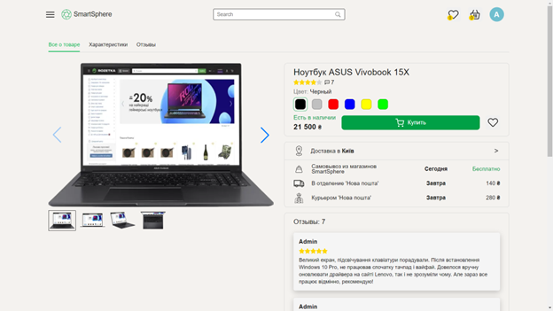
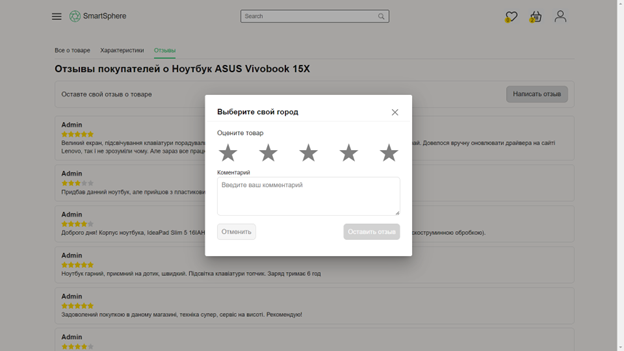

<h1 style="display: flex; align-items: center; justify-content: center;">
    
    Smart Sphere
</h1>

<h1>About project</h1>

<h3 style="line-height: 1.5;">This is my pet project. It is an online store where you can login or register, browse products, add them to your cart and leave feedback.</h3>

<h3 style="font-size: 20px">Built With</h3>
<ul style="list-style-type: none; padding: 0; margin: 0;">
  <li style="position: relative; margin-bottom: 10px; padding-left: 30px;">
    
    
  </li>
  <li style="position: relative; margin-bottom: 10px; padding-left: 30px;">
    
    
  </li>
</ul>

<h1>Usage</h1>

<h2>Welcome page</h2>
<h3 style="line-height: 1.5">You see this page as soon as you enter the website.</h3>

<h2>Product about</h2>
<h3 style="line-height: 1.5">This is a page with photos of the product, a brief description, a choice of delivery city and a small number of reviews.</h3>

<h2>Product characteristics</h2>
<h3 style="line-height: 1.5">In this section you can see product characteristics.</h3>

<h2>Product comments</h2>
<h3 style="line-height: 1.5">This is the page with product reviews.</h3>

<h2>Add product comments</h2>
<h3 style="line-height: 1.5">This is a pop-up dialog box where the user can add a review to the product.</h3>

<h2>Side bar</h2>

<h2>Product basket</h2>
<h3 style="line-height: 1.5">This is the page with products added to the cart.</h3>

<h2>Selecting a delivery city</h2>
<h3 style="line-height: 1.5">This is a pop-up dialog where you can select a city for delivery. We used the Nova Poshta API with available cities.</h3>

<h2>Login</h2>
<h3 style="line-height: 1.5">This is a pop-up dialog box where the user could log into the account.</h3>

<h2>Register</h2>
<h3 style="line-height: 1.5">This is a pop-up dialog box where the user can register.</h3>

